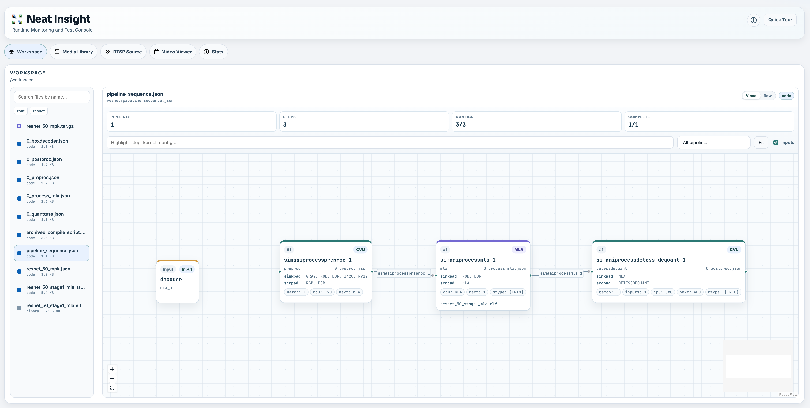
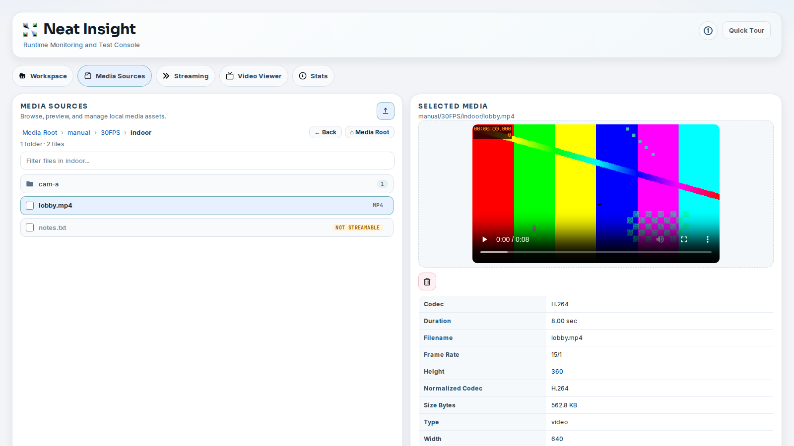
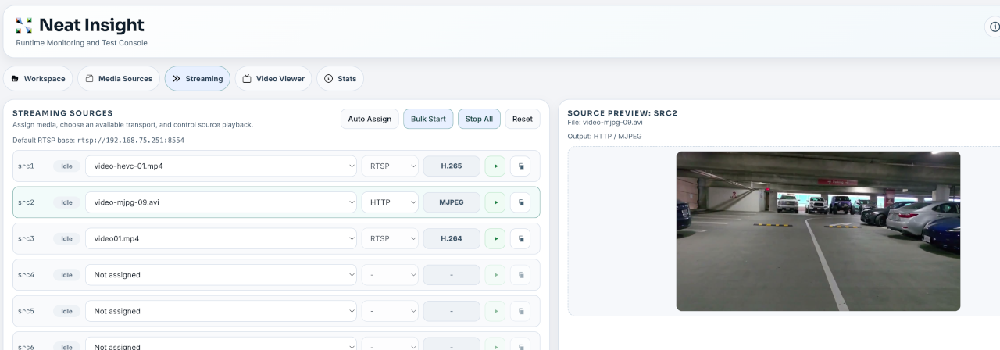
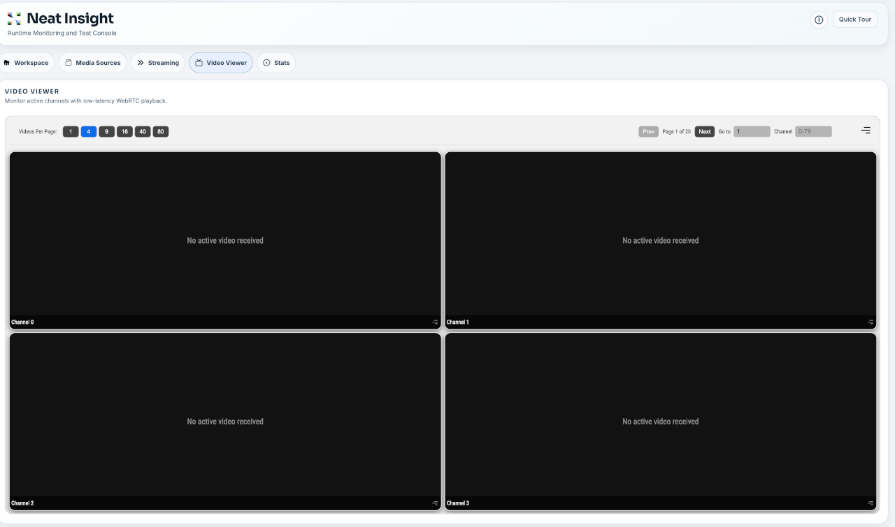

# ユーザーインターフェース

Insightは、ビジョンアプリケーションの検証を行う際に実行する開発タスクを中心に構成されており、ファイル検査、メディアの準備、ソースの起動、出力の確認、およびランタイムの健全性の監視などを行います。

## ワークスペース

ワークスペースビューでは、Insight で表示できるプロジェクトファイルを閲覧できます。Neat 開発環境では、通常これは`/workspace` です。SDK外では、Insight は現在の作業ディレクトリに戻ります。

ワークスペースを使って、次の操作を行います。

- ソースファイル、設定、モデル成果物、および生成された出力の検索と参照。
- プレビュー用のテキスト、コード、Markdown、画像、および選択されたバイナリファイルを表示します。
- MPKパッケージのアーカイブを、手動で展開することなく検査します。
- MLA統計、MPKマニフェスト、パイプラインシーケンスファイルなど、特定の開発成果物を確認できます。

ワークスペースは、アプリケーションが複数のビルド結果やログを生成する場合に特に役立ちます。ワークスペースを使用すると、同じ開発セッション内で、それらの成果物をブラウザからアクセスして確認できます。



## メディアソース

メディアソースは、アプリケーションのテストに使用するメディアファイルを登録および管理する場所です。**メディアのインポート**を選択してインポートダイアログを開き、次の3つのソースから選択します。

- **ローカルファイル**: コンピューターから1つまたは複数のファイルを選択するか、ドラッグ＆ドロップしてください。H.264 MP4ファイルをアップロードすると、Bフレームを無効にして、低遅延再生のためにファイルが最適化され、元のフレームレートが維持されます。
- **カタログ**: SiMaが厳選したビデオカタログからビデオをインポートし、既知のアセットを使用した再現性のあるテストを実行できます。アセットの種類または名前で参照したり、カタログを検索したり、解像度、フレームレート、コーデックでフィルタリングしたり、ビデオをプレビューしたり、次に、1つのバリアントをインポートするか、複数の該当するアセットを選択してインポートします。
- **YouTube**: 通常のYouTube動画のURLを貼り付け、検証してプレビューを表示し、開始時間、クリップの長さ、および出力プロファイルを選択します。Insightは、`1080p30`、`720p30`、または`480p30`で、1分、3分、または5分のクリップをサポートします。インポートされたクリップは、Bフレームが無効になっているWebRTC互換のH.264に変換されます。ライブストリームはサポートされていません。通常の動画またはアーカイブされたライブストリームを使用してください。

カタログとYouTubeからのインポートにはネットワークアクセスが必要です。Insightは、メディアをダウンロードして準備する際に進捗状況を表示し、その結果をローカルメディアライブラリに保存します。

サポートされているビデオ形式には、`mp4`、`mov`、`avi`、`mkv`、および`webm`などの一般的なコンテナ形式が含まれます。Insightは、MJPEGアセットとHEVC/H.265メディアも認識し、コーデックを意識したストリーミングを可能にします。MJPEGおよびHEVCメディアは、元のコーデックの動作でストリーミングできるように保存されます。

メディアをインポートした後、ファイルリストをフィルタリングしたり、選択したファイルのプレビューを表示したり、基本的なメタデータを調べたり、不要になったファイルを削除したりできます。ストリーミングソースを構成する前に、メディアソースを使用して、どのファイルが利用可能か、Insightがどのコーデックを検出したか、およびそれらが読み取り可能かどうかを確認してください。



メディアソースは、インポート、ファイル選択、プレビュー、メタデータ検査、および削除アクションを1つのビューにまとめます。インポートされたカタログアセットは`catalog/`に、YouTubeクリップは`youtube/`に保存されるため、ファイルがどのようにライブラリに追加されたかを識別できます。

## ストリーミングのソース

「ストリーミングソース」ビューでは、アップロードされたメディアファイルをライブソーススロットに変換します。各ソーススロットは、RTSP URLを公開できます。

```text
rtsp://127.0.0.1:8554/src1
rtsp://127.0.0.1:8554/src2
rtsp://127.0.0.1:8554/src3
```

これらのURLは、Insightと同じSDKコンテナーで実行されているアプリケーションに対して正しいものです。アプリケーションがDevKitまたは別の外部マシンで実行されている場合は、SDKホストのIPアドレスと、`neat --json`からマッピングされた`rtsp.tcp`ホストポートを使用してください。

Insightは、割り当てられたメディアからコーデックとトランスポートオプションを選択します。

- H.264形式で、RTSPを介してH.264メディアストリームを送信します。
- H.265形式で、RTSPを介してHEVC/H.265メディアストリームを送信します。
- MJPEGメディアは、RTSPを通じてMJPEG形式で、またはHTTPを通じてmultipart MJPEG形式でストリーミングできます。

コーデックは選択されたメディアによって決定され、UIで手動で変更することはできません。RTSP経由のMJPEGは、RTP互換のMJPEGにエンコードされ、HTTP MJPEGは、カメラ形式のHTTPテストのためにMJPEGフレームを保持できます。

メディアをソースに割り当てたり、個々のソースを開始および停止したり、ソーススロット間で一意のファイルを自動的に割り当てたり、複数のソースをまとめて開始したり、すべてのストリームを停止したり、アプリケーションまたはテストハーネスで使用するためにストリームURLをコピーしたりできます。

このビューは、オブジェクト検出、セグメンテーション、トラッキング、分類、またはGenAIビジョンアプリケーションのために、再現可能な入力ストリームが必要な場合に役立ちます。



ストリーミングソースビューでは、メディアファイルをソーススロットに割り当てたり、ストリームを開始または停止したり、アクティブなストリームURLをコピーしたり、アプリケーションに組み込む前に選択したソースをプレビューしたりできます。

## ビデオビューワー

ビデオビューワーには、ビデオ転送装置から送信される低遅延の WebRTC ストリームが表示されます。

チャンネル `N` について：

```text
video:    UDP 9000 + N
metadata: UDP 9100 + N
```

たとえば、チャンネル `0` は、ビデオ UDP `9000` とメタデータ UDP `9100` を使用します。チャンネル `1` は、ビデオ UDP `9001` とメタデータ UDP `9101` を使用します。

送信側が DevKit または別の外部マシンで実行されている場合は、`neat --json` からマッピングされた `videoUDP` および `metadataUDP` のホストポート範囲を使用します。チャンネル間の計算は同じですが、開始ポートが異なる場合があります。

ビューアーは、オブジェクト検出、分類、姿勢推定、セグメンテーション、トラッキングなど、一般的なビジョン出力のメタデータオーバーレイをレンダリングできます。ビューアーの設定を使用すると、信頼度しきい値、ROI表示、トラッキング履歴、同期バッファーなど、オーバーレイの動作を調整できます。メタデータのタイムスタンプは、ソースの PTS ミリ秒を使用し、利用できない場合は省略されます。

ビデオビューアーを使用して確認してください。

- アプリケーションは、指定されたチャンネルにビデオを送信しています。
- メタデータが、対応するメタデータチャンネルに送信されてきます。
- オーバーレイはビデオフレームに合わせて配置されます。
- ブラウザでの再生は正常です。



ビデオビューワーは、一度に1つまたは複数のチャンネルを表示でき、ページネーションやチャンネル選択コントロールを備えており、大規模なマルチストリームテストに適しています。

## 周辺機器

周辺機器には、ボードに接続されたカメラと、各カメラが報告するモードが表示されます。カメラはボード上の SiMa Sentinel が検出し、Insight は Sentinel のカタログを読み取ります。検出はデバイス情報を読み取るだけで、カメラを開いたりストリーミングしたりしないため、カメラはアプリケーションで引き続き使用できます。**プレビュー**は唯一の例外で、ユーザーが開始した場合にのみ実行されます。カメラエクスポート API は、ボードにアクセスせず、最後のスキャンから動作します。

### 選択したボード

Insight は、ヘッダーに表示される1台の選択済みボードを使用します。これを選択するとボード設定が開き、ボードの変更、接続のテスト、または再フラッシュされたボードのホストキーの信頼を行えます。周辺機器はこの選択を使用します。統計ビューは引き続き従来のローカルまたは `cfg.json` のターゲットを使用し、まだこの選択には従いません。

ボードは次の順序で選択されます。

- **入力したボード**：ボード設定を開き、アドレス、SSH ポート、およびユーザーを指定します。**デフォルトを使用**を選ぶと自動選択に戻ります。
- **ボードにインストールされた Insight**：Insight は実行中のボードを検査します。
- **Neat SDK**：`sima-cli sdk setup --devkit <ip>` でペアリングされた DevKit。

Insight は、実行アカウントのキーを使用して SSH 接続します。パスワードを要求または保存することはありません。認証に失敗すると、ボード上でキーを承認するための `ssh-copy-id` コマンドがページに表示されます。ボードを再フラッシュすると新しい SSH ホストキーが提示されます。Insight は、フィンガープリントを比較して **新しいキーを信頼** を選択するまで接続を拒否します。

### カメラとモード

**更新**を選択してボードをスキャンします。Insight は SiMa Sentinel に再スキャンを依頼し、結果を待ちます。Sentinel はメディアグラフと ISP を通じて MIPI カメラを、V4L2 を通じて USB カメラを検出します。Sentinel がインストールされていない、実行されていない、または周辺機器を報告できない古いバージョンの場合は、ページにその旨が表示されます。`sima-cli neat install sentinel` でインストールまたは更新してください。各カメラについて、ID、接続、デバイス識別子、使用可能状態、およびカメラが報告するピクセル形式、解像度、フレームレートを表示します。各カメラとモードにはサポートレベルがあります。

| レベル | 意味 |
| --- | --- |
| 検証済み | ボード上の Neat Core のサポートルールが、このモードを Core `CameraInput` で使用できると判定しています。 |
| 未サポート | Neat Core のルールで使用できないと判定されています。たとえば USB カメラや NV12 以外の形式です。ページには Sentinel が報告する理由が表示されます。ボードに Neat Core がない場合、どのモードもサポートされません。 |

Sentinel は、Neat Core がボードにインストールするサポートルールを適用します。使用可能状態は Insight が判定します。更新中に各カメラのデバイスノードを保持しているプロセスを確認し、カメラを保持しているプロセスを表示します。Insight が他のユーザーのプロセスを確認できるのは、root として実行されている場合、またはボードでパスワードなしの `sudo` が許可されている場合のみで、それ以外は **不明** と報告されます。

### カメラをプレビューする

**プレビューを開始**を選択すると、カメラの映像を確認できます。ボードは映像をキャプチャし、ハードウェアでエンコードして Insight のビューアーに送信します。プレビューはページ内に表示され、ビューアーチャンネルを1つ予約します。ボードは PyNeat を使ってキャプチャします。PyNeat は Insight が接続するアカウントにインストールされている必要があり（`sima-cli neat install core`）、ない場合はプレビューにその旨が表示されます。

プレビューはカメラを占有するため、停止するまでアプリケーションはカメラを開けません。別のプロセスが使用中のカメラでは Insight はプレビューを開始せず、そのプロセスを停止することもありません。**停止**を選択したとき、ページを離れたとき、スキャンを更新したとき、または選択したボードを変更したときにキャプチャは停止します。また、Insight が監視を停止した後まもなく自動的に停止するため、ブラウザが失われたり Insight が再起動したりしてもカメラが使用中のまま残ることはありません。

プレビューは、Insight が使用可能として一覧表示するモードの MIPI カメラで利用できます。USB カメラは検出およびエクスポートできますが、まだプレビューできません。

### カメラ設定 API

モードメニューの下で形式を選び、**Copy configuration** を選択すると、選択したモードのエクスポート（以下で説明）がクリップボードにコピーされます。MIPI カメラでは、選択したモードを Neat Core が検証していない限りボタンは無効になり、その理由がツールチップに表示されます。API クライアントは選択したモードを `/api/peripherals/cameras/export` に POST し、Python（`pyneat.CameraInputOptions`）、C++、および JSON 表現を受け取れます。Insight はボード上の `libcamerasrc` を読み取らないため、エクスポートはキャプチャバッファー数を設定せず、Apps の `config.yaml` の `camera:` ブロックも含みません。エクスポートは常にカメラを明示的に指定します。USB カメラの場合、API は `CameraInput` 設定ではなくデバイス記述子を返します。

Modalix DevKit で測定された2つの動作がエクスポートに反映されます。厳密なゼロコピーでは起動しなかったため、CPU フォールバック（`allow_cpu_fallback = True`）を許可します。また、カメラは要求されたレートではなく、libcamera が選択したセンサーモードのフレームレートで配信します。1920×1080 の IMX477 は、15 fps または 30 fps を要求した場合でも約 66 fps を配信しました。より少ないフレームが必要な場合は、アプリケーションでフレームをドロップしてください。

## 統計

現在のリリースでは、統計情報表示はプレースホルダーとして機能します。アプリケーションが実行されている間に、システム負荷やランタイムに関するメトリクス（CPU、メモリ、ディスク、利用可能な場合の温度、MLAメモリ、およびInsightを通じてストリーミングされるプロファイリングのタイムラインデータなど）を表示する予定の場所を示します。

この機能は、次回のリリースで完成させる予定です。完成したら、アプリケーションの動作とシステムの動作を分離する必要がある場合に、統計情報表示を使用してください。たとえば、フレームの描画が途切れる問題は、アプリケーションのストリームパスに起因する可能性がありますが、CPU負荷、メモリの使用状況、またはデバイスのランタイム状態とも関連している可能性があります。

## システム情報

システム情報パネルには、Insight が認識できる環境の概要が表示されます。Neat 開発環境では、SDK とコンポーネントの情報、Insight のステータス、更新情報、および `mainUI` や `videoUI` などの公開ポートマッピングが表示されます。

URL がデフォルトポートと一致しない場合に最初に確認すべき場所です。Insight は、利用可能なポートマップを読み取り、ビューアーを開く際にマッピングされた `videoUI` ポートを使用します。コマンドラインワークフローの場合、`neat --json` は同じポートマップ情報を表示します。
