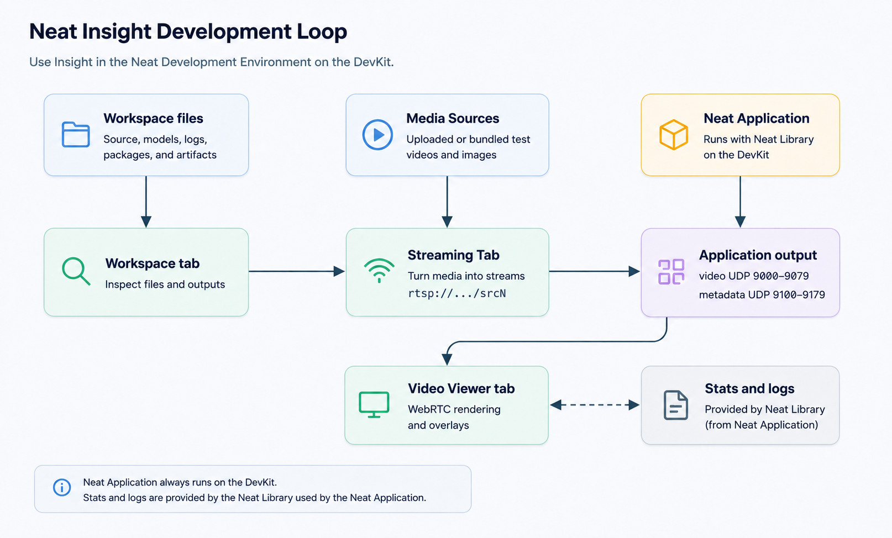

# Концепції

Insight працює разом із вашою програмою під час розробки та тестування. Він не замінює Neat Library або середовище виконання вашої програми. Натомість він надає вам перегляд у браузері артефактів і сигналів, які зазвичай розкидані по контейнеру SDK, DevKit, файлах журналів, медіафайлах і потокових портах.

У Neat Development Environment, Insight також діє як служба тестування медіа. Він може перетворювати завантажені медіафайли на потокові джерела та відображати вихідні дані програми через WebRTC Video Viewer. Коли програма працює поза контейнером SDK, наприклад, на DevKit, використовуйте карту портів SDK із `neat --json`, щоб знайти порти хоста, які повинні використовувати зовнішні клієнти.

Типовий цикл:

1. Перевірте робочий простір та артефакти застосунку.
2. Завантажте або оберіть медіафайли для тестування.
3. Перетворіть медіафайли на джерела потокового відео, наприклад, `rtsp://127.0.0.1:8554/src1`, або HTTP MJPEG для імітації роботи камери MJPEG.
4. Запустіть свою програму, використовуючи ці джерела.
5. Надсилайте відеозаявку та метадані на відповідний канал перегляду Insight.
6. Перегляньте вивід програми у вікні перегляду відео.
7. Використовуйте системну інформацію та журнали для діагностики проблем із продуктивністю або в середовищі виконання. У цій версії розділ «Статистика» представлено як тимчасове рішення, і планується завершити його розробку в наступній версії.

## Для чого потрібен Insight?

Insight розроблено для розробки та перевірки додатків машинного навчання в галузі комп’ютерного зору. Він допомагає вам перевірити, чи узгоджуються медіадані, вихідні дані середовища виконання, метадані та поведінка системи під час тестового запуску.

Використовуйте Insight для:

- Підготуйте відеоматеріали, які можна використовувати повторно.
- Переконайтеся, що вихідні дані програми надходять до відповідного каналу, призначеного для перегляду.
- Відображайте метадані у вигляді накладок для типових результатів обробки зображень.
- Перевірте згенеровану модель, пакет, вихідний код та артефакти профілювання.
- Порівняйте симптоми, що виникають у застосунку, зі станом пристрою або середовища виконання SDK. Розділ «Статистика» є запланованим місцем для реалізації цього процесу, але в поточній версії він виконує лише функцію тимчасового заповнювача.

## Які аспекти не є Insight?

Insight не замінює ваше інтегроване середовище розробки (IDE). Продовжуйте використовувати звичайний редактор, термінал, систему контролю версій і інструменти для збірки. Insight доповнює цей процес, надаючи вам можливість переглядати артефакти робочого простору, тестові матеріали, налаштування потоків, відеовихід, метадані та проводити діагностику в середовищі виконання через веб-браузер.
