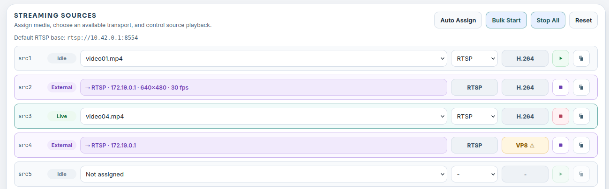

# 使用者介面

Insight 的設計是以您在驗證視覺應用程式時所執行的開發任務為中心：檢查檔案、準備媒體、啟動來源、檢視輸出，以及監控執行階段的狀態。

## 工作區

「工作區」檢視可讓您瀏覽對 Insight 可見的專案檔案。在 Neat 開發環境中，這通常是 `/workspace`；在 SDK 之外，Insight 會切換到目前的本機目錄。

使用「工作區」來：

- 搜尋和瀏覽原始檔案、設定、模型成品以及產生的輸出結果。
- 預覽文字、程式碼、Markdown 格式、圖片，以及選取的二進位檔案。
- 無需手動解壓縮，即可檢查 MPK 套件檔案。
- 檢視專用開發構件，例如 MLA 統計資料、MPK 資訊檔和流程序列檔案。

工作區在應用程式產生多個建置輸出和日誌時特別有用。它提供一種可透過瀏覽器存取的檢視方式，讓您可以在相同的開發階段中檢查這些構件。


## 媒體來源

「媒體來源」是您新增和管理用於應用程式測試的媒體檔案的地方。選取「匯入媒體」以開啟匯入對話方塊，然後選擇以下三種來源之一：

- **本機檔案**：選擇或將一個或多個檔案從您的電腦拖曳到此處。上傳的 H.264 MP4 檔案會經過處理，以實現低延遲播放，同時停用 B 幀，但保留原始幀率。
- **目錄**：從 SiMa 整理的影片目錄中匯入，以便進行可重複的測試，並使用已知的素材。您可以按素材類型或名稱瀏覽，搜尋目錄，按解析度、幀率和編碼器進行篩選，預覽影片，然後匯入一個變體，或選擇並匯入多個符合條件的素材。
- **YouTube：**貼上一般的 YouTube 影片網址，驗證後即可顯示預覽，然後選擇開始時間、片段長度和輸出設定。Insight 支援 1 分鐘、3 分鐘或 5 分鐘的片段，解析度為 `1080p30`、`720p30` 或 `480p30`。匯入的片段會轉換為適合 WebRTC 的 H.264 格式，並停用 B 幀。目前不支援即時直播；請使用一般影片或已儲存的直播影片。

從目錄和 YouTube 匯入需要網路連線。Insight 會在下載和準備媒體時顯示進度，然後將結果儲存在本機媒體庫中。

支援的影片格式包括常見的容器格式，例如 `mp4`、`mov`、`avi`、`mkv` 和 `webm`。Insight 還能識別 MJPEG 資源和 HEVC/H.265 媒體，以便進行支援特定編解碼器的串流。MJPEG 和 HEVC 媒體會保留，以便可以使用其原始編解碼器行為進行串流。

匯入媒體後，您可以篩選檔案清單、預覽選取的檔案、檢查其基本中繼資料，或刪除不再需要的檔案。在使用「媒體來源」設定串流來源之前，請先使用「媒體來源」，這樣您就可以知道哪些檔案可用、Insight 偵測到哪些編解碼器，以及它們是否可讀。

媒體庫會以資料夾的形式顯示。選取資料夾列會開啟該資料夾，並列出其子資料夾與影片；每個資料夾列都會顯示其中包含多少個可串流的檔案。使用**返回**回到上層資料夾，使用**媒體根目錄**跳到媒體庫的最上層，並使用麵包屑導覽查看目前所在位置或跳到任何層級。篩選功能會搜尋目前的資料夾及其下的所有內容，並以相對於目前資料夾的路徑顯示相符結果。Insight 無法串流的檔案會以灰色列出，並標示**無法串流**標籤，因此您仍可預覽或刪除它們；串流來源中的指派對話方塊則會隱藏這些檔案。資料夾名稱只是您自訂的一般標籤，例如 `30FPS/` 或 `120FPS-720p-h264/`；Insight 絕不會從中讀取影片設定。在 Neat SDK 中，媒體庫位於 `/workspace/.insight-media/`，因此即使 SDK 重新啟動，媒體庫也會保留。上傳的檔案一律會放在媒體庫的最上層。


「媒體來源」將匯入、檔案選取、預覽、中繼資料檢查和刪除操作結合在一個視窗中。從目錄匯入的資源會儲存在 `catalog/` 下，而 YouTube 影片片段會儲存在 `youtube/` 下，因此您可以識別檔案是如何進入媒體庫的。

## 串流媒體來源

「串流來源」檢視會將上傳的媒體檔案轉換為即時來源插槽。每個來源插槽都可以顯示一個 RTSP URL：

```text
rtsp://127.0.0.1:8554/src1
rtsp://127.0.0.1:8554/src2
rtsp://127.0.0.1:8554/src3
```

這些 URL 對於在與 Insight 相同的 SDK 容器中執行的應用程式而言是正確的。如果應用程式在 DevKit 或其他外部機器上執行，請使用 SDK 主機的 IP 位址，以及從 `neat --json` 中映射的 `rtsp.tcp` 主機連接埠。

Insight 會從已指派的媒體中選擇編解碼器和傳輸選項：

- 透過 RTSP 傳輸 H.264 媒體串流，格式為 H.264。
- 透過 RTSP 傳輸 HEVC/H.265 媒體串流，格式為 H.265。
- MJPEG 媒體可以透過 RTSP 以 MJPEG 格式串流，或透過 HTTP 以多部分 MJPEG 格式串流。

編碼器是由所選的媒體決定，且不會在使用者介面中手動更改。透過 RTSP 傳輸的 MJPEG 會被編碼成與 RTP 相容的 MJPEG，而 HTTP MJPEG 則可以保留 MJPEG 幀，以便進行類似相機的 HTTP 測試。

選取來源列的檔案欄位，即可開啟**指派媒體給 srcN**對話方塊，其中提供與「媒體來源」相同的資料夾瀏覽器；選擇一部影片，然後按**指派**，或按**清除**以取消指派。您可以啟動和停止個別的來源，自動將唯一的檔案指派給不同的來源插槽，批量啟動來源，停止所有串流，並複製串流 URL 以供應用程式或測試工具使用。

當您需要針對物件偵測、分割、追蹤、分類或 GenAI 視覺應用程式，建立可重複的輸入串流時，這個檢視畫面會很有用。


「串流來源」檢視畫面可讓您將媒體檔案指派給來源插槽，啟動或停止串流，複製作用中的串流 URL，並在將其連接到應用程式之前預覽所選的來源。

### 外部串流

任何 RTSP、WebRTC（WHIP）或 SRT 工具都可以直接發布到來源插槽，例如從主機發布網路攝影機畫面：

```bash
ffmpeg -f v4l2 -i /dev/video0 -c:v libx264 -preset veryfast -tune zerolatency -g 30 -pix_fmt yuv420p \
  -f rtsp -rtsp_transport tcp rtsp://<insight-host>:8554/src2
```

預設只有 RTSP 連接埠（8554）會對應到 SDK 容器外部；WHIP 和 SRT 發布端必須在容器內或原生安裝於 DevKit 的環境中執行。

Insight 會在約兩秒內將此類插槽顯示為**外部**：該列變為唯讀，標籤會列出通訊協定、發布端位址，並在探測完成後列出解析度和幀率。當串流使用 Neat 管線無法解碼的編解碼器（H.264、H.265 或 MJPEG 以外的任何編解碼器）時，編解碼器欄位會變為琥珀色並顯示警告。「複製網址」仍可使用；無論使用何種發布通訊協定，應用程式都照常讀取 `rtsp://…/srcN`。

最先發布的一方會佔用插槽。在外部插槽上啟動檔案，或發布到 Insight 已在串流的插槽，都會遭到拒絕，而不會悄悄取代正在執行的串流。**接管**（外部列中的方形停止圖示）會在確認後中斷外部發布端（及其讀取端）的連線；插槽會回到閒置狀態，並保留先前的檔案指派。會自動重新連線的發布端可能會再次佔用閒置的插槽，因此若要將插槽改用於檔案，請先停止外部工具。

「來源預覽」面板可以用來源本身的幀率即時顯示外部插槽；預覽**預設為關閉**（依瀏覽器記住設定），關閉時不會進行任何解碼。選取另一個外部插槽後，會顯示「連線中」指示器，直到新串流的第一個畫面抵達為止。這段等待時間主要是等待發布端的下一個關鍵幀，因此對於打算預覽的串流，請將關鍵幀間隔設為約一秒（上例中在 30 fps 時使用 `-g 30`；編碼器的預設值通常為數秒）。在 SDK 容器內，容器外部的發布端和讀取端會以 Docker 橋接位址顯示，而非其實際 IP。

自動指派、批次啟動、全部停止和重設絕不會影響外部串流；結果訊息會列出略過的插槽。重設仍會清除每個插槽已儲存的指派，包括外部插槽。



外部插槽會顯示發布端、其位址以及探測到的串流格式；當 Neat 管線無法解碼串流時，編解碼器欄位會變為琥珀色。

### 拉取的串流

網路上已存在的串流（通常是 IP 攝影機）可以拉取到插槽中。按一下閒置插槽的檔案按鈕，將對話方塊切換到**串流 URL**，輸入攝影機的 `rtsp://` 或 `rtsps://` URL，若攝影機需要，也輸入其使用者名稱和密碼，然後按**拉取**。Insight 會設定 mediamtx 拉取該串流，並原封不動地轉送到 `rtsp://…:8554/srcN`；不會進行任何解碼或重新編碼，應用程式可以像讀取其他插槽一樣讀取此插槽。

畫面抵達後，該列會以藍綠色顯示**已拉取**，標籤會列出來源主機、解析度和幀率，編解碼器欄位則顯示編解碼器。在此之前，會顯示**連線中…**。如果無法連線到攝影機，該列會變為琥珀色的**無法連線**並顯示原因；mediamtx 會持續重試，攝影機恢復後，該列會自行回到已拉取。如果按下**拉取**時攝影機拒絕使用者名稱或密碼，對話方塊會顯示該訊息，插槽維持不變。只有當攝影機之後才開始拒絕認證資訊（例如一開始無法連線）時，該列才會以紅色顯示**驗證失敗**並維持此狀態：請按**停止**，然後以正確的認證資訊重新拉取。密碼只會保存在記憶體中；Insight 絕不會將其寫入磁碟、再次顯示或記錄到日誌，而且 Insight 重新啟動後不會還原已拉取的插槽。

按下該列的**停止**會解除拉取，插槽會回到閒置狀態，並保留先前的檔案指派。對已拉取的插槽指派檔案、啟動或接管都會遭到拒絕。自動指派、批次啟動、全部停止和重設會像略過外部插槽一樣略過已拉取的插槽，並在結果訊息中列出。

「來源預覽」面板對已拉取插槽的運作方式與外部插槽完全相同（預覽預設為關閉）。拉取需要迴路介面上的 mediamtx 控制 API；如果啟動時無法使用此 API（請參閱「埠口和網路」），拉取按鈕會回報此情況。在此版本中，使用自我簽署憑證的 `rtsps://` 攝影機會被回報為無法連線，並附上憑證訊息。

### 幀率

來源預覽面板會在所選來源的檔案名稱下方顯示 FPS 控制項，設定影格速率後，來源列會在檔案名稱旁顯示該速率。指派影片後，控制項會顯示從檔案中偵測到的幀率。使用 `−` 和 `+` 按鈕以 5 為單位調整，或輸入 1 到 240 之間的整數。

當數值與檔案的原生幀率不同時，啟動來源會先建立一個*轉碼版本*：依照與 Insight 媒體目錄相同的編碼規則（H.264 baseline 或 H.265 main、`yuv420p`、無 B 幀、一個參考幀、一秒的封閉式 GOP），以要求的固定幀率重新編碼的影片副本。該列會顯示**編碼中**，並在預覽面板中顯示進度列，接著變為**即時**並串流該轉碼版本。轉碼版本儲存在媒體目錄下的 `.renditions/` 中，並記錄在 `renditions.json` 裡，因此下次啟動時（包括重新啟動 Insight 之後）會直接重複使用，而不會再次編碼。以內容不同的檔案取代來源檔案，會使其舊的轉碼版本失效。刪除來源檔案會一併移除其轉碼版本。位元組完全相同的檔案（例如以其他名稱存在的副本）會共用同一個轉碼版本，該版本會保留到其中最後一個檔案被刪除或取代為止。如果編碼失敗，來源檔案不會受到影響，也不會保留部分完成的轉碼版本。

MJPEG 來源無法變更幀率；其控制項會停用。

「串流來源」工具列中的**清除轉碼版本**會刪除所有快取的轉碼版本（播放中來源正在使用的除外）；這些版本會在下次啟動時重新建立。

## 影片檢視器

視訊檢視器會顯示來自視訊轉發器的低延遲 WebRTC 串流。

對於頻道 `N`：

```text
video:    UDP 9000 + N
metadata: UDP 9100 + N
```

例如，頻道 `0` 使用視訊 UDP `9000` 和中繼資料 UDP `9100`；頻道 `1` 使用視訊 UDP `9001` 和中繼資料 UDP `9101`。

如果傳送者在 DevKit 或其他外部機器上執行，請使用從 `neat --json` 映射的 `videoUDP` 和 `metadataUDP` 主機連接埠範圍。 頻道數學運算相同，但起始連接埠可能不同。

檢視器可以呈現常用視覺輸出（包括物件偵測、分類、姿勢估計、分割和追蹤）的中繼資料疊加層。 檢視器設定可讓您調整疊加層行為，例如置信度閾值、ROI 顯示、追蹤歷史記錄和同步緩衝。 中繼資料時間戳使用來源 PTS 毫秒，如果無法使用，則會省略。

### 全域設定與頻道設定

檢視器設定分為兩個範圍。檢視器頁面的設定按鈕會開啟全域設定。圖塊狀態列最右側的按鈕會開啟該頻道的設定；對話方塊的標題會顯示頻道名稱。

頻道會沿用全域設定。若要為頻道設定自己的值，請開啟其設定，開啟該設定旁的 **Own value**，設定值後選取 **Save**。頻道自行設定的值優先於全域值。再次關閉 **Own value** 後，頻道會沿用全域值。類別顏色依項目分別處理：頻道對話方塊會將全域項目標示為 **from global**，而 **Override** 會將其中一個項目複製為該頻道的項目。

全域對話方塊會在每項設定下方列出自行設定值的頻道。**Use global value** 會立即移除頻道自己的值，無需按 **Save**。**Reset all channels to the global settings…** 會移除所有頻道自己的值；ROI 會保留。

設定儲存在瀏覽器中。這些設定不會在不同的瀏覽器或電腦之間共用。

### 中繼資料顏色

疊加層會從一個由 40 種顏色組成的共用調色盤中選取顏色，讓不同的識別對象在擁擠的畫面中仍能清楚區分。前 20 種顏色的區別最明顯；其餘 20 種只有在一個頻道同時顯示超過 20 個識別對象時才會使用。每種中繼資料類型各自定義何謂識別對象：

| 中繼資料類型 | 著色依據 | 共用該顏色的部分 |
|---|---|---|
| `object-detection` | 類別 `label` | 方框、標籤、置信度 |
| `segmentation` | 類別 `label` | 遮罩、輪廓、方框、標籤 |
| `classification` | 類別 `label` | 每一行標籤 |
| `tracking` | 軌跡 `id` | 方框、標籤、歷史路徑 |
| `pose-estimation` | 姿勢 `id` | 關鍵點、骨架、關鍵點名稱、方框、標籤 |

顏色會在識別對象首次出現時依頻道分配，並在頻道保持連線期間維持不變。同一頻道上的類別標籤共用一份分配，因此 `person` 在偵測、分割和分類中看起來都相同。覆寫設定依中繼資料類型分別套用：物件偵測中針對 `person` 的項目不會改變分割或分類中 `person` 的顏色。軌跡與姿勢會分別分配。識別對象在畫面上時會保有其顏色。當它離開畫面超過 5 秒後，其顏色可能會交給新的識別對象。當畫面上的識別對象多於調色盤可容納的數量時，新的識別對象會與最久未繪製的識別對象共用顏色，而不會從任何可見的對象奪走顏色。

沒有 `id` 的軌跡與姿勢會以單一中性色繪製。若傳送者希望每個人或每條軌跡使用不同顏色，就必須包含 `id`。

物件偵測與分割設定可包含選用的各類別覆寫項目。針對某個標籤的項目會固定該類別的顏色與線條樣式。標籤為 `default` 的項目會固定所有沒有自己項目之類別的顏色。若沒有任何項目，所有類別都會自動著色。

### 中繼資料延遲

只有在視訊畫面顯示時其中繼資料已抵達瀏覽器，疊加層才會繪製。檢視器會將視訊延後視訊同步緩衝的時間（預設為 350 ms），讓中繼資料有時間抵達。如果應用程式傳送中繼資料的時間晚於緩衝所允許的範圍，即使視訊和訊息速率看起來正常，其疊加層也會消失。

當最近的訊息中至少有一半在其畫面之後才抵達時，圖塊的狀態列會顯示 **Metadata late** 標籤。選取該標籤即可查看：

| 數值 | 說明 |
|---|---|
| Arrives after its frame | 畫面顯示後經過多久其中繼資料才抵達，由此瀏覽器測得。 |
| Video sync buffer | 此頻道目前生效的緩衝。 |
| Late messages | 最近的訊息中，因抵達太晚而無法繪製的比例。 |

面板提供兩種方式，將緩衝提高到足以涵蓋測得延遲的值：

| 按鈕 | 作用 |
|---|---|
| **Raise for this channel to N ms** | 只設定此頻道的視訊同步緩衝。其他頻道會保留其設定。 |
| **Raise globally to N ms** | 設定全域視訊同步緩衝。此值適用於所有沒有自己值的頻道。如果此頻道原本有自己的值，該值會被移除。 |
| **Use global value (V ms)** | 當全域視訊同步緩衝已足以涵蓋測得延遲時，會取代 **Raise globally to N ms** 顯示。移除此頻道自己的值；全域值不會變更。 |

所有受影響頻道的視訊都會延後增加的時間。檢視器絕不會自行變更緩衝，面板也絕不會降低全域緩衝。變更後，由於瀏覽器會逐步切換到較大的緩衝，檢視器會等待幾秒鐘再重新判斷延遲。

當延遲抵達的訊息少於十分之一時，標籤就會消失。如果所需的緩衝會超過上限 4000 ms，面板便不會提供按鈕：應用程式必須更早傳送其中繼資料。如果因中繼資料不屬於已顯示的畫面而無法測得延遲，面板會說明此情況，同樣不會提供按鈕。

典型的情況是應用程式原封不動地轉送編碼後的輸入串流，並在解碼與推論完成後才傳送中繼資料，因為其視訊不會等待推論。

使用視訊檢視器進行確認：

- 應用程式正在將影片傳送到預期的頻道。
- 中繼資料即將傳送到對應的中繼資料通道。
- 疊圖會與影片畫面對齊。
- 瀏覽器播放功能運作正常。


影片檢視器可以一次顯示一個或多個通道，並提供分頁和通道選擇控制項，以便進行更大規模的多串流測試。

## 統計資料

目前的版本中，「統計資料」檢視僅為一個佔位符。它標示了應用程式執行期間，系統負載和執行階段指標的預定位置，包括 CPU、記憶體、磁碟、溫度（如果有的話）、MLA 記憶體，以及透過 Insight 串流傳輸的分析時間軸資料。

此功能預計在下一個版本中完成。完成後，當您需要將應用程式行為與系統行為分開時，請使用「統計資料」。例如，畫面遺漏問題可能來自應用程式串流路徑，但也可能與 CPU 負載、記憶體壓力或裝置執行階段狀態相關。

## 系統資訊

系統資訊面板會摘要說明 Insight 可以檢視的環境。在 Neat 開發環境中，它可以顯示 SDK 和元件資訊、Insight 狀態、更新資訊，以及公開的連接埠對應，例如 `mainUI` 和 `videoUI`。

當 URL 與預設連接埠不符時，這是您應該首先檢查的地方。Insight 會讀取可用的連接埠對應，並在開啟檢視器時使用對應的 `videoUI` 連接埠。對於命令列工作流程，`neat --json` 會顯示相同的連接埠對應資訊。
