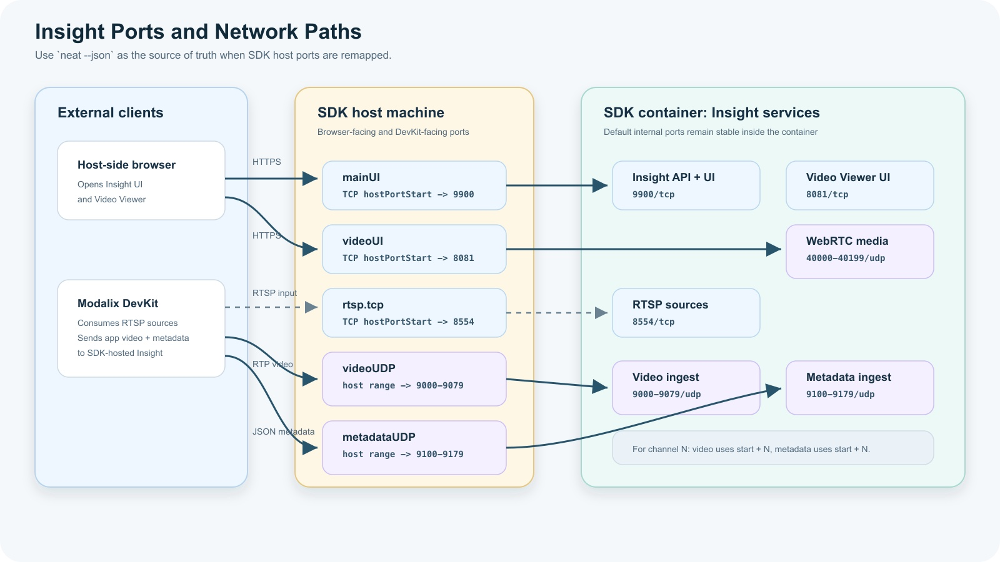

# Ports and Network Behavior

Insight uses several ports during normal operation. The default ports are the ports used inside the SDK container or on a directly installed DevKit. In the Neat Development Environment, the SDK publishes those services onto host ports. If a default host port is already in use, `sima-cli` can allocate another available host port.



| Port-map name | Default port or range | Protocol | Purpose |
| --- | --- | --- | --- |
| `mainUI` | `9900` | HTTPS/TCP | Main Insight web UI, HTTP API, and HTTP MJPEG streaming sources. |
| `videoUI` | `8081` | HTTPS/TCP | WebRTC Video Viewer UI. |
| `rtsp.tcp` | `8554` | RTSP/TCP | RTSP streaming sources created from uploaded media. |
| `videoUDP` | `9000-9079` | UDP | Video RTP ingest for viewer channels `0-79`. |
| `metadataUDP` | `9100-9179` | UDP | Metadata JSON ingest for viewer channels `0-79`. |
| `webRTC` | `40000-40199` | UDP | WebRTC media and metadata DataChannel egress from vf to the browser. |
| `webSSH` | `8022` | HTTPS/TCP | Browser shell to a paired DevKit when available. |

## Find the actual SDK port map

In the SDK, do not assume default host ports are available. Run:

```bash
neat --json
```

The output includes `insight.webUiUrl` and an `exposedPorts` array:

```json
{
  "exposedPorts": [
    {"hostPortEnd": null, "hostPortStart": 9900, "name": "mainUI", "protocol": "tcp"},
    {"hostPortEnd": 9179, "hostPortStart": 9100, "name": "metadataUDP", "protocol": "udp"},
    {"hostPortEnd": null, "hostPortStart": 8554, "name": "rtsp.tcp", "protocol": "tcp"},
    {"hostPortEnd": 9079, "hostPortStart": 9000, "name": "videoUDP", "protocol": "udp"},
    {"hostPortEnd": null, "hostPortStart": 8081, "name": "videoUI", "protocol": "tcp"},
    {"hostPortEnd": 40199, "hostPortStart": 40000, "name": "webRTC", "protocol": "udp"},
    {"hostPortEnd": null, "hostPortStart": 8022, "name": "webSSH", "protocol": "tcp"}
  ],
  "insight": {
    "serviceState": "Running",
    "venv": "/opt/neat-insight/venv",
    "webUiUrl": "https://10.0.0.210:9900"
  }
}
```

If a host port was remapped, the `hostPortStart` value is the port that external clients should use. `hostPortEnd` is present for port ranges such as video, metadata, and WebRTC.

## Channel mapping

The Video Viewer uses paired video and metadata ports. For channel `N`:

```text
video:    UDP 9000 + N
metadata: UDP 9100 + N
```

For example:

| Viewer channel | Video port | Metadata port |
| --- | --- | --- |
| `0` | `9000` | `9100` |
| `1` | `9001` | `9101` |
| `2` | `9002` | `9102` |

Keep the channel number consistent between video and metadata. If your application sends video to channel `3`, send corresponding metadata to the metadata port for channel `3`.

## SDK port mapping

In the Neat Development Environment, ports may be remapped by the SDK container. Insight reads the SDK port-map configuration when available so UI links point to the browser-reachable host port.

This matters most for the Video Viewer. The internal default viewer port is `8081`, but the browser-facing port can be different when the SDK maps `videoUI` to another host port.

Use System Information in the Insight UI to check the actual exposed ports before assuming a URL is wrong.

## Configure applications with the port map

Use the application location to decide whether to use default container ports or SDK host-exposed ports.

| Application location | RTSP input from Insight | Video/metadata output to Insight |
| --- | --- | --- |
| Inside the SDK container | `rtsp://127.0.0.1:8554/srcN` | `127.0.0.1:9000 + channel` and `127.0.0.1:9100 + channel` |
| On a DevKit or another external machine | `rtsp://<sdk-host-ip>:<rtsp.tcp hostPortStart>/srcN` | `<sdk-host-ip>:<videoUDP hostPortStart + channel>` and `<sdk-host-ip>:<metadataUDP hostPortStart + channel>` |

HTTP MJPEG sources use the main Insight UI/API port. In the SDK, use the `mainUI` host port from `neat --json` for those URLs.

For example, if `neat --json` reports:

```json
{"name": "rtsp.tcp", "hostPortStart": 18554, "protocol": "tcp"}
{"name": "videoUDP", "hostPortStart": 19000, "hostPortEnd": 19079, "protocol": "udp"}
{"name": "metadataUDP", "hostPortStart": 19100, "hostPortEnd": 19179, "protocol": "udp"}
```

Then an application on a DevKit should use:

```text
RTSP source src1:   rtsp://<sdk-host-ip>:18554/src1
video channel 0:    <sdk-host-ip>:19000
metadata channel 0: <sdk-host-ip>:19100
video channel 3:    <sdk-host-ip>:19003
metadata channel 3: <sdk-host-ip>:19103
```

If the application and Insight run in the same SDK container, use the default local ports instead.

## Related tools

- **Neat Development Environment** provides the containerized build and run environment where Insight is bundled.
- **Neat Library** provides the application APIs used to build and run vision workloads.
- **sima-cli** installs and upgrades Insight packages and other Neat artifacts.
- **Model Compiler and LLiMa** produce model artifacts that you can inspect through Workspace and validate through applications running beside Insight.
