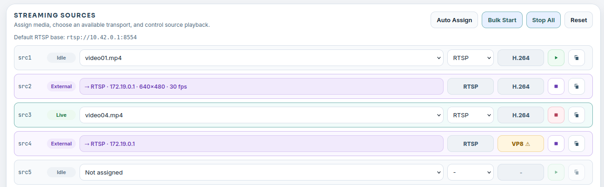

# User Interface

Insight is organized around the development tasks you perform while validating a vision application: inspect files, prepare media, start sources, view output, and watch runtime health.

## Workspace

The Workspace view lets you browse the project files visible to Insight. In the Neat Development Environment, this is normally `/workspace`; outside the SDK, Insight falls back to the current working directory.

Use Workspace to:

- Search and browse source files, configuration, model artifacts, and generated outputs.
- Preview text, code, Markdown, images, and selected binary artifacts.
- Inspect MPK package archives without manually extracting them.
- View specialized development artifacts such as MLA stats, MPK manifests, and pipeline sequence files.

Workspace is especially useful when an application produces several build outputs and logs. It gives you a browser-accessible way to inspect those artifacts while staying in the same development session.


## Media Sources

Media Sources is where you add and manage media files used for application tests. Select **Import Media** to open the import dialog, then choose one of three sources:

- **Local files**: Choose or drag and drop one or more files from your computer. H.264 MP4 uploads are normalized for low-latency playback with B-frames disabled while preserving the source frame rate.
- **Catalog**: Import from SiMa's curated video catalog for repeatable tests with known assets. Browse by asset type or name, search the catalog, filter by resolution, frame rate, and codec, preview a video, then import one variant or select and import several matching assets.
- **YouTube**: Paste a regular YouTube video URL, validate it to display a preview, and choose a start time, clip length, and output profile. Insight supports 1-, 3-, or 5-minute clips at `1080p30`, `720p30`, or `480p30`. The imported clip is converted to WebRTC-friendly H.264 with B-frames disabled. Active live streams are not supported; use a regular video or an archived live stream.

Catalog and YouTube imports require network access. Insight displays progress while it downloads and prepares the media, then saves the result in the local media library.

Supported video formats include common container formats such as `mp4`, `mov`, `avi`, `mkv`, and `webm`. Insight also recognizes MJPEG assets and HEVC/H.265 media for codec-aware streaming. MJPEG and HEVC media are preserved so they can be streamed with their original codec behavior.

After importing media, you can filter the file list, preview a selected file, inspect its basic metadata, or delete files that are no longer needed. Use Media Sources before configuring streaming sources so you know which files are available, which codec Insight detected, and whether they are readable.


Media Sources combines importing, file selection, preview, metadata inspection, and delete actions in one view. Imported catalog assets are stored under `catalog/`, and YouTube clips are stored under `youtube/`, so you can identify how files entered the library.

## Streaming Sources

The Streaming Sources view turns uploaded media files into live source slots. Each source slot can expose an RTSP URL:

```text
rtsp://127.0.0.1:8554/src1
rtsp://127.0.0.1:8554/src2
rtsp://127.0.0.1:8554/src3
```

Those URLs are correct for applications running in the same SDK container as Insight. If the application runs on a DevKit or another external machine, use the SDK host IP address and the mapped `rtsp.tcp` host port from `neat --json`.

Insight selects codec and transport options from the assigned media:

- H.264 media streams over RTSP as H.264.
- HEVC/H.265 media streams over RTSP as H.265.
- MJPEG media can stream over RTSP as MJPEG or over HTTP as multipart MJPEG.

The codec is determined by the selected media and is not manually changed in the UI. MJPEG over RTSP is encoded into RTP-compatible MJPEG, while HTTP MJPEG can preserve MJPEG frames for camera-style HTTP testing.

You can assign media to a source, start and stop individual sources, auto-assign unique files across source slots, bulk start sources, stop all streams, and copy stream URLs for use by applications or test harnesses.

This view is useful when you need repeatable input streams for an object detection, segmentation, tracking, classification, or GenAI vision application.


The Streaming Sources view lets you assign media files to source slots, start or stop streams, copy the active stream URL, and preview the selected source before wiring it into an application.

### External streams

Any RTSP, WebRTC (WHIP) or SRT tool can publish directly to a source slot, for example a webcam from the host:

```bash
ffmpeg -f v4l2 -i /dev/video0 -c:v libx264 -preset veryfast -tune zerolatency -g 30 -pix_fmt yuv420p \
  -f rtsp -rtsp_transport tcp rtsp://<insight-host>:8554/src2
```

Only the RTSP port (8554) is mapped out of the SDK container by default; WHIP and SRT publishers must run inside the container or on a DevKit-native install.

Insight shows such a slot as **External** within about two seconds: the row is read-only, the chip lists protocol, publisher address and, once probed, resolution and frame rate. The codec cell turns amber with a warning when the stream uses a codec Neat pipelines cannot decode (anything other than H.264, H.265 or MJPEG). Copy URL stays available; applications keep reading `rtsp://…/srcN` as usual, regardless of the publish protocol.

Whoever publishes first holds the slot. Starting a file on an External slot, or publishing to a slot Insight is already streaming, is rejected instead of silently replacing the running stream. **Take over** — the square stop glyph in the External row — disconnects the external publisher (and its readers) after a confirmation; the slot returns to Idle with its previous file assignment. A publisher that reconnects automatically may re-take an idle slot, so stop the external tool first when you want to reuse the slot for a file.

The Source Preview panel can show an External slot live at the source's own frame rate; the preview is **off by default** (remembered per browser) and decodes nothing while off. After selecting another external slot, a "Connecting" indicator is shown until the first frame of the new stream arrives. That wait is mostly the time until the publisher's next keyframe, so give streams you intend to preview a keyframe interval of about a second (`-g 30` at 30 fps in the example above; encoder defaults are often several seconds). Inside the SDK container, publishers and readers outside the container appear with the Docker bridge address rather than their real IP.

Auto Assign, Bulk Start, Stop All and Reset never touch an External stream; the result message lists which slots were skipped. Reset still clears the stored assignment of every slot, External ones included.



External slots show the publisher, its address and the probed stream format; the codec cell turns amber when Neat pipelines cannot decode the stream.

## Video Viewer

The Video Viewer displays low-latency WebRTC streams from the video forwarder.

For channel `N`:

```text
video:    UDP 9000 + N
metadata: UDP 9100 + N
```

For example, channel `0` uses video UDP `9000` and metadata UDP `9100`; channel `1` uses video UDP `9001` and metadata UDP `9101`.

If the sender runs on a DevKit or another external machine, use the mapped `videoUDP` and `metadataUDP` host port ranges from `neat --json`. The channel math is the same, but the starting ports may be different.

The viewer can render metadata overlays for common vision outputs, including object detection, classification, pose estimation, segmentation, and tracking. Viewer settings let you tune overlay behavior such as confidence thresholds, ROI display, tracking history, and synchronization buffering. Metadata timestamps use source PTS milliseconds and are omitted when unavailable.

### Metadata colors

Overlays pick colors from one shared palette so that different identities stay apart on a crowded frame. Each metadata type defines what identity means:

| Metadata type | Colored by | Parts that share the color |
|---|---|---|
| `object-detection` | class `label` | box, label, confidence |
| `segmentation` | class `label` | mask, outline, box, label |
| `classification` | class `label` | each label line |
| `tracking` | track `id` | box, label, history trail |
| `pose-estimation` | pose `id` | keypoints, skeleton, keypoint names, box, label |

Colors are allocated per channel the first time an identity appears and stay fixed for as long as the channel stays connected. Class labels share one allocation on a channel, so `person` looks the same in detection, segmentation and classification. Overrides are per metadata type: an object-detection entry for `person` does not recolor `person` in segmentation or classification. Tracks and poses are allocated separately. When more identities appear than the palette holds, the color of the identity seen longest ago is reused, so the identities currently on screen stay as distinct as possible. With more identities on screen than the palette holds, colors above the palette size can change between frames.

Tracks and poses without an `id` draw in one neutral color. Senders that want per-person or per-track colors must include `id`.

Object detection and segmentation settings hold optional per-class overrides. An entry for a label fixes that class's color and line style. An entry labelled `default` fixes the color of every class without its own entry. Without any entries, all classes are colored automatically.

Use the Video Viewer to confirm:

- The application is sending video to the expected channel.
- Metadata is arriving on the matching metadata channel.
- Overlays align with the video frame.
- Browser playback is healthy.


The Video Viewer can show one or more channels at a time, with pagination and channel selection controls for larger multi-stream tests.

## Stats

The Stats view is a placeholder in the current release. It marks the planned location for system load and runtime metrics while an application is running, including CPU, memory, disk, temperature when available, MLA memory, and profiling timeline data streamed through Insight.

This feature is intended to be completed in the next release. Once complete, use Stats when you need to separate application behavior from system behavior. For example, a dropped frame problem may come from the application stream path, but it may also correlate with CPU load, memory pressure, or device runtime state.

## System Information

The system information panel summarizes the environment Insight can see. In the Neat Development Environment, it can show SDK and component information, Insight status, update information, and exposed port mappings such as `mainUI` and `videoUI`.

This is the first place to check when a URL does not match the default port. Insight reads the available port map and uses the mapped `videoUI` port when opening the viewer. For command-line workflows, `neat --json` shows the same port-map information.
