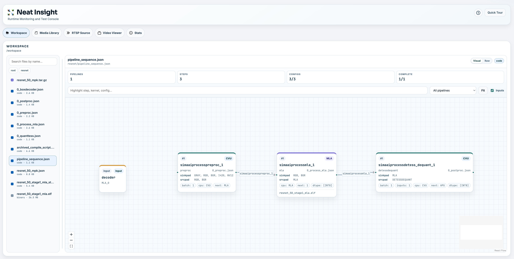
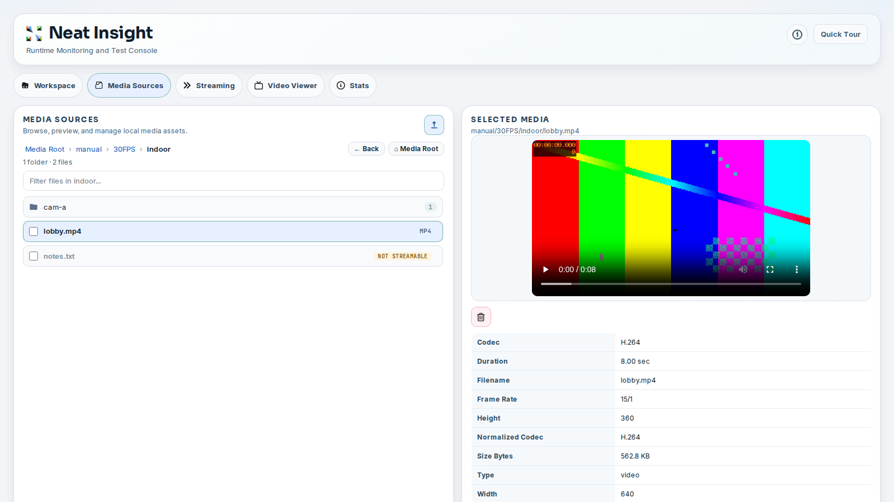
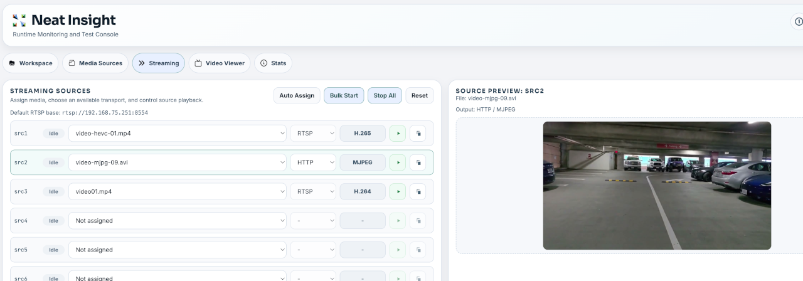
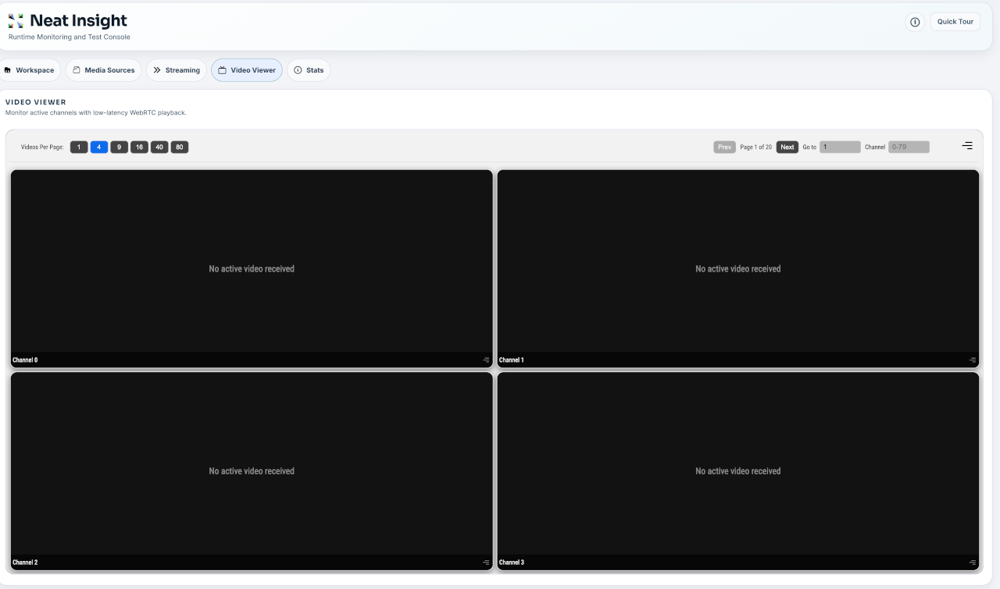

# User Interface

Insight is organized around the development tasks you perform while validating a vision application: inspect files, prepare media, start sources, view output, and watch runtime health.

## Workspace

The Workspace view lets you browse the project files visible to Insight. In the Neat Development Environment, this is normally `/workspace`; outside the SDK, Insight falls back to the current working directory.

Use Workspace to:

- Search and browse source files, configuration, model artifacts, and generated outputs.
- Preview text, code, Markdown, images, and selected binary artifacts.
- Inspect MPK package archives without manually extracting them.
- View specialized development artifacts such as MLA stats, MPK manifests, and pipeline sequence files.

Workspace is especially useful when an application produces several build outputs and logs. It gives you a browser-accessible way to inspect those artifacts while staying in the same development session.



## Media Sources

Media Sources is where you manage media files used for application tests. You can upload videos or images, filter the file list, preview selected files, inspect basic media metadata, and delete files that are no longer needed.

Supported video formats include common container formats such as `mp4`, `mov`, `avi`, `mkv`, and `webm`. Insight also recognizes MJPEG assets and HEVC/H.265 media for codec-aware streaming. When supported tooling is available, uploaded H.264 MP4 files are optimized for low-latency streaming. MJPEG and HEVC media are preserved so they can be streamed with their original codec behavior.

Use Media Sources before configuring streaming sources so you know which files are available, which codec Insight detected, and whether they are readable.



Media Sources combines file selection, preview, metadata inspection, upload, and delete actions in one view.

SiMa provides curated videos for repeatable testing. Use these when you need a known media set:

```text
https://artifacts.sima-neat.com/assets/videos/720p16/video01.mp4
...
https://artifacts.sima-neat.com/assets/videos/720p16/video16.mp4

https://artifacts.sima-neat.com/assets/videos/480p30/video01.mp4
...
https://artifacts.sima-neat.com/assets/videos/480p30/video16.mp4
```

Download the files you need, then import them with the Media Sources upload action.

## Streaming Sources

The Streaming Sources view turns uploaded media files into live source slots. Each source slot can expose an RTSP URL:

```text
rtsp://127.0.0.1:8554/src1
rtsp://127.0.0.1:8554/src2
rtsp://127.0.0.1:8554/src3
```

Those URLs are correct for applications running in the same SDK container as Insight. If the application runs on a DevKit or another external machine, use the SDK host IP address and the mapped `rtsp.tcp` host port from `neat --json`.

Insight selects codec and transport options from the assigned media:

- H.264 media streams over RTSP as H.264.
- HEVC/H.265 media streams over RTSP as H.265.
- MJPEG media can stream over RTSP as MJPEG or over HTTP as multipart MJPEG.

The codec is determined by the selected media and is not manually changed in the UI. MJPEG over RTSP is encoded into RTP-compatible MJPEG, while HTTP MJPEG can preserve MJPEG frames for camera-style HTTP testing.

You can assign media to a source, start and stop individual sources, auto-assign unique files across source slots, bulk start sources, stop all streams, and copy stream URLs for use by applications or test harnesses.

This view is useful when you need repeatable input streams for an object detection, segmentation, tracking, classification, or GenAI vision application.



The Streaming Sources view lets you assign media files to source slots, start or stop streams, copy the active stream URL, and preview the selected source before wiring it into an application.

## Video Viewer

The Video Viewer displays low-latency WebRTC output from the video forwarder. It supports up to 80 channels. Inside the SDK container, video channels use UDP ports `9000-9079`, and matching metadata channels use UDP ports `9100-9179`.

For channel `N`:

```text
video:    UDP 9000 + N
metadata: UDP 9100 + N
```

For example, channel `0` uses video UDP `9000` and metadata UDP `9100`; channel `1` uses video UDP `9001` and metadata UDP `9101`.

If the sender runs on a DevKit or another external machine, use the mapped `videoUDP` and `metadataUDP` host port ranges from `neat --json`. The channel math is the same, but the starting ports may be different.

The viewer can render metadata overlays for common vision outputs, including object detection, classification, pose estimation, segmentation, and tracking. Viewer settings let you tune overlay behavior such as confidence thresholds, ROI display, tracking history, and metadata delay.

Use the Video Viewer to confirm:

- The application is sending video to the expected channel.
- Metadata is arriving on the matching metadata channel.
- Overlays align with the video frame.
- Browser playback is healthy.



The Video Viewer can show one or more channels at a time, with pagination and channel selection controls for larger multi-stream tests.

## Stats

The Stats view is a placeholder in the current release. It marks the planned location for system load and runtime metrics while an application is running, including CPU, memory, disk, temperature when available, MLA memory, and profiling timeline data streamed through Insight.

This feature is intended to be completed in the next release. Once complete, use Stats when you need to separate application behavior from system behavior. For example, a dropped frame problem may come from the application stream path, but it may also correlate with CPU load, memory pressure, or device runtime state.

## System Information

The system information panel summarizes the environment Insight can see. In the Neat Development Environment, it can show SDK and component information, Insight status, update information, and exposed port mappings such as `mainUI` and `videoUI`.

This is the first place to check when a URL does not match the default port. Insight reads the available port map and uses the mapped `videoUI` port when opening the viewer. For command-line workflows, `neat --json` shows the same port-map information.
